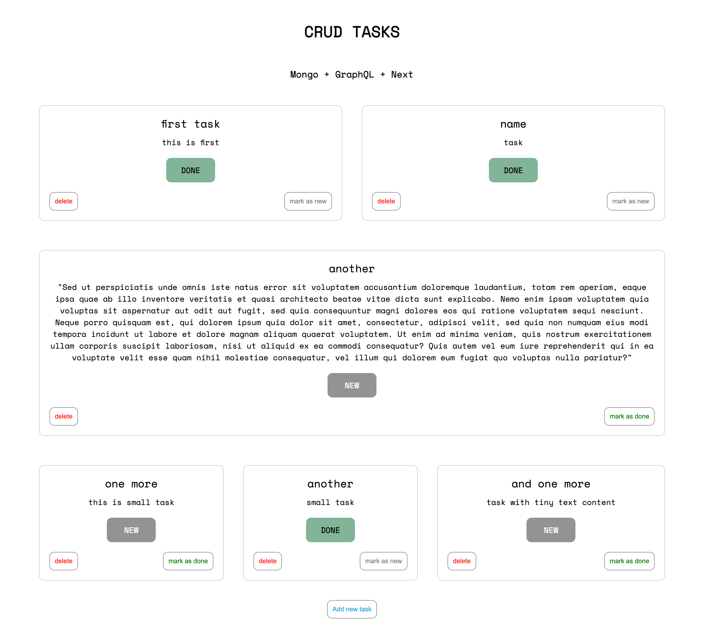

# Project Name

CRUD Next+Graph+Mongo+Express

## Table of Contents

1. [Requirements](#requirements)
2. [Installation](#installation)
3. [Screenshot](#screenshot)


## Requirements

List of requirements to run the project, for example:
- Node.js
- Next.js

## Installation

1. Clone the repository to your local machine:

    ```bash
    git clone https://github.com/zbihlei/magic8ball.git
    ```

2. Navigate to the project directory:

    ```bash
    cd yourproject
    ```

3. Install dependencies:

    ```bash
    npm install
    ```

4. Run dev mode:

    ```bash
    cd frontend
    cd crud
    npm run dev
    ```

       ```bash
    cd backend
    npm run start
    ```

## Screenshot


